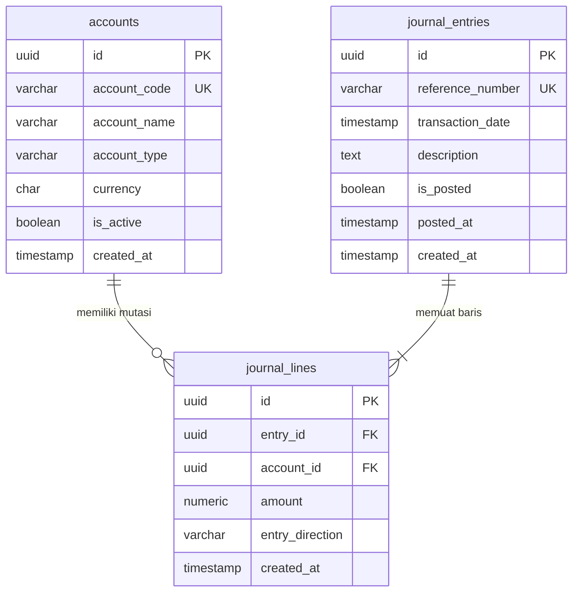

# Entity Relationship Diagram: Double-Entry Financial Ledger

```mermaid
erDiagram
    accounts ||--o{ journal_lines : "memiliki mutasi"
    journal_entries ||--|{ journal_lines : "memuat baris"

    accounts {
        uuid id PK
        varchar account_code UK
        varchar account_name
        varchar account_type
        char currency
        boolean is_active
        timestamp created_at
    }

    journal_entries {
        uuid id PK
        varchar reference_number UK
        timestamp transaction_date
        text description
        boolean is_posted
        timestamp posted_at
        timestamp created_at
    }

    journal_lines {
        uuid id PK
        uuid entry_id FK
        uuid account_id FK
        numeric amount
        varchar entry_direction
        timestamp created_at
    }
```
