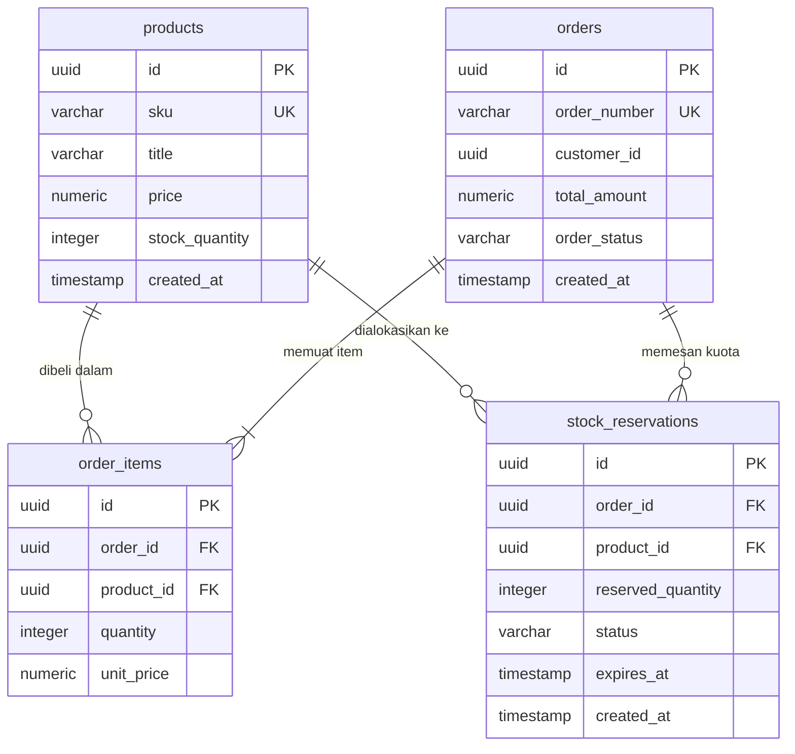

# Entity Relationship Diagram: E-Commerce Flash-Sale Inventory

```mermaid
erDiagram
    products ||--o{ order_items : "dibeli dalam"
    orders ||--|{ order_items : "memuat item"
    products ||--o{ stock_reservations : "dialokasikan ke"
    orders ||--o{ stock_reservations : "memesan kuota"

    products {
        uuid id PK
        varchar sku UK
        varchar title
        numeric price
        integer stock_quantity
        timestamp created_at
    }

    orders {
        uuid id PK
        varchar order_number UK
        uuid customer_id
        numeric total_amount
        varchar order_status
        timestamp created_at
    }

    order_items {
        uuid id PK
        uuid order_id FK
        uuid product_id FK
        integer quantity
        numeric unit_price
    }

    stock_reservations {
        uuid id PK
        uuid order_id FK
        uuid product_id FK
        integer reserved_quantity
        varchar status
        timestamp expires_at
        timestamp created_at
    }
```
