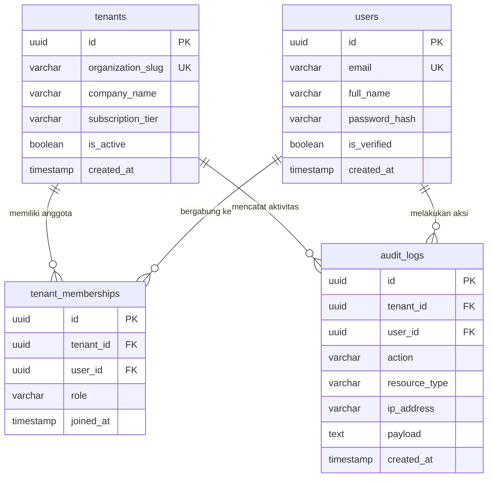

# Entity Relationship Diagram: Multi-Tenant B2B SaaS Core

```mermaid
erDiagram
    tenants ||--o{ tenant_memberships : "memiliki anggota"
    users ||--o{ tenant_memberships : "bergabung ke"
    tenants ||--o{ audit_logs : "mencatat aktivitas"
    users ||--o{ audit_logs : "melakukan aksi"

    tenants {
        uuid id PK
        varchar organization_slug UK
        varchar company_name
        varchar subscription_tier
        boolean is_active
        timestamp created_at
    }

    users {
        uuid id PK
        varchar email UK
        varchar full_name
        varchar password_hash
        boolean is_verified
        timestamp created_at
    }

    tenant_memberships {
        uuid id PK
        uuid tenant_id FK
        uuid user_id FK
        varchar role
        timestamp joined_at
    }

    audit_logs {
        uuid id PK
        uuid tenant_id FK
        uuid user_id FK
        varchar action
        varchar resource_type
        varchar ip_address
        text payload
        timestamp created_at
    }
```
