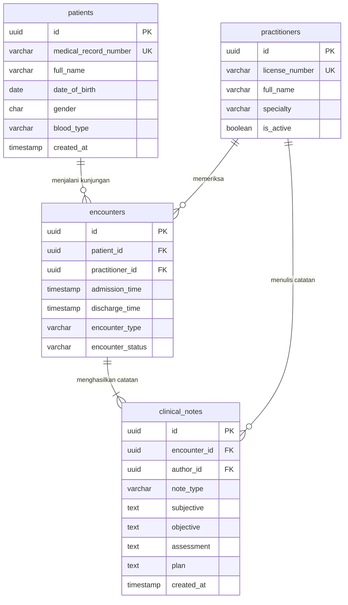

# Entity Relationship Diagram: Hospital Electronic Medical Record (EMR)

```mermaid
erDiagram
    patients ||--o{ encounters : "menjalani kunjungan"
    practitioners ||--o{ encounters : "memeriksa"
    encounters ||--|{ clinical_notes : "menghasilkan catatan"
    practitioners ||--o{ clinical_notes : "menulis catatan"

    patients {
        uuid id PK
        varchar medical_record_number UK
        varchar full_name
        date date_of_birth
        char gender
        varchar blood_type
        timestamp created_at
    }

    practitioners {
        uuid id PK
        varchar license_number UK
        varchar full_name
        varchar specialty
        boolean is_active
    }

    encounters {
        uuid id PK
        uuid patient_id FK
        uuid practitioner_id FK
        timestamp admission_time
        timestamp discharge_time
        varchar encounter_type
        varchar encounter_status
    }

    clinical_notes {
        uuid id PK
        uuid encounter_id FK
        uuid author_id FK
        varchar note_type
        text subjective
        text objective
        text assessment
        text plan
        timestamp created_at
    }
```
