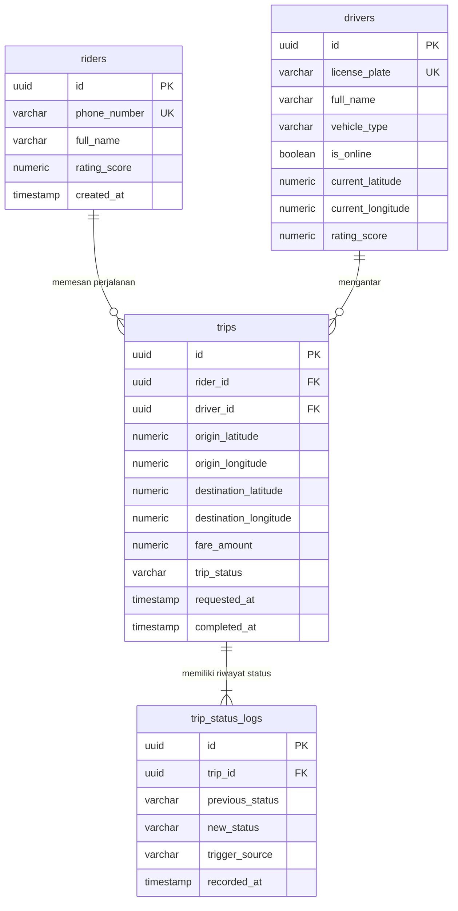

# Entity Relationship Diagram: On-Demand Ride-Hailing Matchmaking

```mermaid
erDiagram
    riders ||--o{ trips : "memesan perjalanan"
    drivers ||--o{ trips : "mengantar"
    trips ||--|{ trip_status_logs : "memiliki riwayat status"

    riders {
        uuid id PK
        varchar phone_number UK
        varchar full_name
        numeric rating_score
        timestamp created_at
    }

    drivers {
        uuid id PK
        varchar license_plate UK
        varchar full_name
        varchar vehicle_type
        boolean is_online
        numeric current_latitude
        numeric current_longitude
        numeric rating_score
    }

    trips {
        uuid id PK
        uuid rider_id FK
        uuid driver_id FK
        numeric origin_latitude
        numeric origin_longitude
        numeric destination_latitude
        numeric destination_longitude
        numeric fare_amount
        varchar trip_status
        timestamp requested_at
        timestamp completed_at
    }

    trip_status_logs {
        uuid id PK
        uuid trip_id FK
        varchar previous_status
        varchar new_status
        varchar trigger_source
        timestamp recorded_at
    }
```
