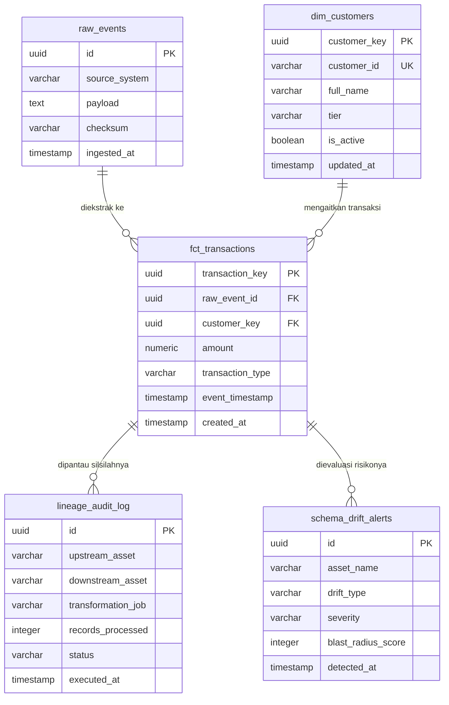

# Entity Relationship Diagram: Data Observability & Lineage Ledger

```mermaid
erDiagram
    raw_events ||--o{ fct_transactions : "diekstrak ke"
    dim_customers ||--o{ fct_transactions : "mengaitkan transaksi"
    fct_transactions ||--o{ lineage_audit_log : "dipantau silsilahnya"
    fct_transactions ||--o{ schema_drift_alerts : "dievaluasi risikonya"

    raw_events {
        uuid id PK
        varchar source_system
        text payload
        varchar checksum
        timestamp ingested_at
    }

    dim_customers {
        uuid customer_key PK
        varchar customer_id UK
        varchar full_name
        varchar tier
        boolean is_active
        timestamp updated_at
    }

    fct_transactions {
        uuid transaction_key PK
        uuid raw_event_id FK
        uuid customer_key FK
        numeric amount
        varchar transaction_type
        timestamp event_timestamp
        timestamp created_at
    }

    lineage_audit_log {
        uuid id PK
        varchar upstream_asset
        varchar downstream_asset
        varchar transformation_job
        integer records_processed
        varchar status
        timestamp executed_at
    }

    schema_drift_alerts {
        uuid id PK
        varchar asset_name
        varchar drift_type
        varchar severity
        integer blast_radius_score
        timestamp detected_at
    }
```
